# Corrected history and growth rings

## Contract and context

Full perimeters arrive per fire in chronological order with aligned source attributes.
The differential history removes later-retracted ground from earlier mappings and emits
only added polygonal area. Points are copied unchanged by the publication layer. Ring
geometry is in the common history CRS; measurements use geodesic square meters/acres.
Fires must occupy consecutive row blocks under the full identity columns.

The desired result is a retrospectively corrected visualization of growth. It is not the
union of everything ever reported, and disappearance from later mapping is interpreted
as a correction rather than observed contraction of burned ground.

## Complexity assessment

| Dimension | Score | Concrete reason |
| --- | --- | --- |
| History and state | 3 | Every later footprint can remove ground from every earlier footprint and change its representative metadata. |
| Rule interaction | 2 | Growth candidates, metadata blocks, sparse deltas, emitted rings, and visible rings have distinct selection boundaries. |
| Mathematical reasoning | 2 | Backward set intersection, forward difference, and measured cumulative union must agree on their domains. |
| Scale and representation | 2 | Independent fire blocks use a bounded worker queue, and visible-ring measurements authenticate an exact ordered WKB sequence. |
| Failure and concurrency | 1 | Worker results or exceptions are collected in input order before publication by the generation layer. |

**Complex, total 10.** Geometry correction and source attribution must be explained
together: a visually correct ring with the wrong date or cost is still incorrect.

## Two passes and their argument

Let G₀ … Gₙ₋₁ be polygonal footprints, with missing/empty footprint treated as the empty
set. Start Cₙ₋₁ = Gₙ₋₁ and walk backward with Cᵢ = Gᵢ ∩ Cᵢ₊₁. By induction,
Cᵢ = intersection of all Gⱼ for j ≥ i. Consequently Cᵢ ⊆ Cᵢ₊₁: each corrected footprint
fits inside the next one. A forward pass emits Dᵢ = Cᵢ \ Cᵢ₋₁, with C₋₁ empty.
The Dᵢ are disjoint in exact set arithmetic and their union equals the latest footprint.

*The original fire perimeters stay visible while blue copies slide down into the backward
row. A translucent copy of G₂ then slides onto G₁; ground outside the copy turns rose
and dissolves. The corrected C₁ then slides onto G₀ and removes its retracted ground.
Copies of all three corrected footprints slide down into the forward row, changing from
blue to gold. Then copies of the complete corrected
footprints slide diagonally from the middle row onto their successors. Already counted
ground dissolves, leaving only the amber differences. Movement aligns the same geographic
coordinates; it does not represent a fire moving across the landscape. Static and
reduced-motion views show original, corrected, and added ground together, with hatching
on the retracted parts of the original observations.*

In the illustrated perimeters, the latest map retracts a northwestern lobe of the middle
map. That corrected middle footprint then retracts a southern lobe of the earliest map.
The forward pass retains the entire corrected first footprint as D₀, then just the new
pieces as D₁ and D₂. The copy used for the final subtraction is **all of C₁**, including
ground already counted in D₀; subtracting D₁ alone would count that ground twice.

As a one-dimensional analogue, let G = [0,4], [0,3], [0,5]. Corrected footprints are
[0,3], [0,3], [0,5]. The first ring covers [0,3], the second adds nothing, and the third
covers (3,5]. Directly subtracting the uncorrected first perimeter would leave a false
first-stage strip (3,4], obscuring the later correction.

Missing geometry in the middle intersects earlier history to empty; it is not silently
skipped. The implementation extracts polygonal content and drops line/point-only results.
A cheap `covers` predicate finds candidate growth without constructing every difference.
Floating-point slivers can pass that test yet yield no polygonal difference; those
candidates produce no emitted row after the actual difference is computed.

## Attribution, deltas, and visible progression

Each growth candidate represents its block through the last observation before the next
candidate, or through the final observation for the last block. It keeps that final row's
attributes and source date, because intervening non-growth rows corrected or updated the
same retained footprint. Choosing the first growth row's metadata would miss the correction.

*The first surviving footprint comes from candidate 0, but its attributes come from row
1.
Row 2 starts the next growth block. Geometry ownership and metadata ownership are related
without being identical.*

For acreage, containment, and cost fields, subtract the most recent earlier candidate
representative with a present numeric value; use zero if none exists. Missing current
values yield a missing delta, zero stays present, and negative corrections remain possible.
These are source-field changes, distinct from positive geometric added area.

Attribution is assigned before sliver removal. A candidate that emits no geometry can
still supply a numeric baseline to a later candidate. Thus complete present changes
can telescope across candidates, but no telescoping claim is made across only the rings
finally displayed. For example values 10, missing, 7 produce changes 10, missing, −3.

Visible progression uses emitted rows with a valid observation time and area strictly
greater than one square meter. Measure newly covered ground by cumulative union:
`added[i] = max(0, area(union through i) − previous union area)`. This also avoids double
counting overlapping caller-provided rings. Store a SHA-256 digest over length-prefixed
WKB including SRID in displayed order. That binds reused added-area measurements to the
same shapes and ordering; it is not merely a set of geometry hashes.

## Worked boundaries and alternatives

A final empty footprint retracts every earlier footprint under the chosen correction
contract. Equal corrected footprints form one growth block even when dates or attributes
change. A disconnected new island becomes a new ring. A zero-area or undated emitted
shape does not enter the visible sequence. The strict one-square-meter comparison rejects
exact equality; the underlying geometry engine and geodesic measurement still determine
real numerical boundaries.

A monotone forward union would preserve withdrawn ground forever and therefore expresses
a different policy. Comparing each mapping only with its immediate predecessor would
fail to propagate a final shrinkage through all earlier history. The backward recurrence
propagates the entire later intersection in one pass, avoiding an explicit comparison of
every earlier footprint against every later footprint.

## Costs and limitations

For N observations, there are O(N) backward intersections and forward growth checks;
actual construction costs depend on vertices and overlay intersections. Sparse attribute
delta searches can scan earlier candidates, so worst-case attribute work is O(N²).
Visible added-area calculation performs an expanding sequence of unions whose total
geometry cost depends on intermediate complexity. WKB hashing is linear in encoded bytes.
Storage includes O(N) corrected geometry references and all generated overlay geometry.

Across fires, at most four workers process ordered results, with a queue buffer of twice
the worker count; independent fires cannot exchange geometry or metadata. Full input and
final output frames are still materialized. Cache/publication correctness belongs to
[geography generations](geography-generations.md). Invalid input geometry, arbitrary
GEOS robustness, area roundoff, source chronology truth, and hash collisions are outside
the set-theoretic guarantee.

## Implementation and verification

Owners: [differential rows](../../src/peri_scribe/fires/differential.py) and
[progression measurement](../../src/peri_scribe/perimeters/progression.py).
Tests: [differential regressions](../../tests/tests/standard/peri_scribe/fires/test_differential.py),
[differential properties](../../tests/tests/property_based/peri_scribe/fires/test_differential.py),
[progression](../../tests/tests/standard/peri_scribe/perimeters/test_progression.py), and
[progression properties](../../tests/tests/property_based/peri_scribe/perimeters/test_progression.py).

[Geography proofs](../../tests/formal/lean/PeriScribe/Geography.lean) establish the set
recurrence. [DifferentialRows](../../tests/formal/lean/PeriScribe/DifferentialRows.lean)
and its [formal boundary inventory](../../tests/formal/lean/spatial_boundaries.md)
cover representative blocks, sparse deltas, and the visible ordered sequence.
[Conformance](../../tests/formal/conformance/test_differential_rows.py) compares complete
rows, geometry, provenance, and measurements with the executable cell-set policy, including
explicitly injected numerical-empty outcomes. These abstractions do not prove GEOS,
geodesic measurement, or every floating-point sliver; their stated assumptions and sampled
real-library checks are part of the guarantee.
