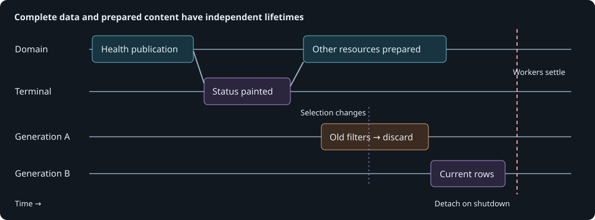

# Monitor presentation scheduling

## Contract and complexity

The terminal consumes complete immutable snapshots from a domain
[session](monitor-sessions.md). The session has no knowledge of tabs, controls, colors,
or the first frame. Presentation owns those choices and requests domain resources using
`RefreshHealth`, `RefreshRecords`, `RefreshReport`, `LoadOlder`, and `LoadRun`.

| Dimension | Score | Reason |
| --- | --- | --- |
| History and state | 2 | User selection can refer to an older snapshot while new evidence arrives. |
| Rule interaction | 2 | First-frame gating, explicit requests, and background preparation share work. |
| Mathematical reasoning | 0 | No additional numerical algorithm. |
| Scale and representation | 2 | Formatting runs off the event loop and coalesces obsolete generations. |
| Failure and concurrency | 3 | Reader completion, shutdown, and asynchronous widget updates have different lifetimes. |

**Total 9: complex.** This note covers presentation scheduling; domain admission,
subscription, and reader ownership guarantees are defined by the session contract.

## First frame and subsequent preparation

Startup requests complete health evidence, including missing command context. The
controller formats the assessment and applies Status widgets. Only the terminal's
after-refresh callback admits background preparation of the diagnostic record stream and
report. Displaying an empty shell does not satisfy the startup target.

*The domain commits complete versions independently of the terminal. Background content
starts after Status has painted. A newer user selection invalidates generation A while
its worker finishes; only generation B is accepted for display. Shutdown detaches the
consumer before settling remaining workers.*

An early explicit request may start the requested resource before that callback; it
does not unlock all background work. Requests for the same resource share the preparation
already in flight. A queued background request can be promoted without interrupting an
admitted operation or opening a second reader. Once the initial resources are requested,
the session refreshes them on filesystem changes and periodic reconciliation.

This separates useful initial latency from total preparation cost. Preparing all content
before the first frame couples Status to Markdown parsing and diagnostic table creation.
Loading solely on selection postpones that cost until the user navigates. Background
preparation after the first complete frame avoids both dependencies, subject to available
CPU and I/O. There is no guarantee that very early navigation finds preparation finished.

## Version and selection consistency

The controller accepts only increasing session versions. A complete snapshot includes
all current resources, so coalescing publications cannot lose a report update when a newer
record update arrives. The domain never waits for widgets to acknowledge publication.

Following live data replaces the visible record snapshot. Pausing preserves that
snapshot and its selected command while collection continues. Loading evidence explicitly
selects the requested command, even when its full history is outside interactive retention.
Returning to live data adopts the latest session snapshot.

Every change to records, selection, or filters increments a presentation generation.
The worker captures those inputs and prepares text, phase rows, and table rows without
mutating widgets. On completion, the controller compares generations. Obsolete results
are discarded and preparation repeats with current inputs. Applying long tables yields
periodically and checks generation and attachment again, allowing input and shutdown to
make progress. Completion is recorded only for the generation actually applied.
Each table retains its own mapping from generation-qualified row keys to evidence until
that table is replaced. A click in the other table during a batch yield still resolves
its original event; a queued click from a replaced generation cannot resolve to a new
event that happens to reuse the same sequence number.

For example, a search for `timeout` starts generation A. The user switches commands and
clears the query, creating B while A runs. Publishing A after B would replace the new
command with stale filtered rows. The generation check prevents that replacement. The
same guard applies when new live evidence supersedes a captured state.
Historical evidence focus additionally checks that the user still has the same command,
phase, and follow mode selected after preparation. Returning to live evidence while that
worker runs must not restore the earlier target's details or cursor afterward.

Markdown updates are serialized separately. A completed update records its checkpoint
only if the report still equals the latest delivered report and the terminal is attached.
A newer report causes another pass. Leaving Report does not cancel its preparation.
Cosmetic age text has a presentation-owned deadline; evidence expiry and health thresholds
remain domain policy. Moving the observation clock backward re-evaluates both layers.

## Shutdown, bounds, and verification

Shutdown first stops presentation publication and detaches its subscription. The session
then stops admission and settles admitted reads before closing descriptors. Presentation
workers finish without publishing into removed controls. Cancelling an awaiting caller
must not abandon the worker that still owns a reader.

For E retained events, P planned phases, and R retained runs, row preparation costs
O(E + P + R) time and memory, plus formatting output. Interactive retention bounds E and
R; a selected historical run can be larger. One preparation worker coalesces intermediate
requests rather than creating one worker per input change. Session mailboxes retain one
complete snapshot per subscriber. Widget updates still require the UI thread; background
preparation is not a promise of zero rendering cost.

The checked `MonitorSession` and `MonitorTasks` protocols cover admission, priority,
coalesced delivery, cancellation, stop-before-publication, and release-after-read. See
[observer contracts](../../tests/formal/observers.md). Pure formatting introduces no new
domain policy. Ordinary headless-terminal tests cover the framework-specific after-refresh
boundary, early navigation, generation rejection, paused selection, report replacement,
and detached widgets; these are outside the finite domain protocol model.

Implementation: [controller](../../src/peri_scribe/monitor/controller.py),
[row preparation](../../src/peri_scribe/monitor/display.py),
[widget application](../../src/peri_scribe/monitor/rendering.py), and
[terminal adapter](../../src/peri_scribe/monitor/app.py).

## Local startup measurement

On 10 October 2026, the real `mise monitor data/2026` command on the local ARM64 Mac
(macOS 15.8.1, Python 3.14.8) reached its complete Status frame in **1.95–2.20 seconds**
(median **1.96**, three final fresh-process trials with warm filesystem caches). The
original source took **16.71–16.79 seconds** (median **16.75**, two trials). Background
content finished by **2.86–3.24 seconds** from launch (median **2.87**). The first final
trial spent more time in the launcher/import stage. Earlier quiet trials measured
1.93–2.03 seconds; an overlapping-test sample took 2.33 seconds. All are retained in the
measurement record rather than discarding slower samples.

The fixed comparison time retained 1,932 runs and 107,290 compact events from the local
2026 logs. Normalized history and prepared Status hashes matched the original exactly.
The harness times a real 120×42 pseudo-terminal through the first after-refresh callback;
correctness hashing runs after timed preparation. Measurements include launcher/import
cost and exclude dependency setup. Cold storage and production hardware remain
unmeasured, so this is an approximately two-second local result, not a hard maximum.

Reproducible harness, input manifest, per-trial timings, terminal captures, source hashes,
and comparison details are retained locally under
`data/profiling/2026-10-10-monitor-startup/`. See its `README.md` for commands and the
distinction between startup, background readiness, and validation time.
