# Alpha-aware preview palette reduction

## Contract and assessment

Quantization accepts an RGBA image and returns RGBA pixels drawn from at most 256 working
palette entries. The palette always reserves transparent black, opaque red, yellow,
white, and black. Transparent pixels stay transparent, opaque interiors stay opaque,
and partially transparent edge pixels stay partial. Required exact opaque colors remain
available without spending dynamic palette entries. There is no dithering.

| Dimension | Score | Reason |
| --- | --- | --- |
| History and state | 1 | Heap splits and iterative assignments retain evolving cluster state. |
| Rule interaction | 2 | Reserved colors, opacity classes, integer rounding, and shared palette budget constrain clustering. |
| Mathematical reasoning | 3 | A custom alpha-aware metric and weighted principal-axis splitting minimize a defined visible error. |
| Scale and representation | 2 | Unique colors with occurrence counts replace repeated pixels during optimization. |
| Failure and concurrency | 0 | The quantizer owns no external effects or concurrency. |

**Complex: 8 because mathematical reasoning is 3.** The quantizer preserves essential
map colors and transparency while improving compression. Lossless WebP later preserves
these quantized pixels exactly; quantization itself remains lossy.

## Visible error on two backgrounds

For RGB vector `c` and normalized opacity `a`, the feature is
`f(c,a) = (a(c - 127.5), a sqrt(3) 127.5)`. This is a four-dimensional vector.
Its squared distance is the average squared RGB compositing error on black and white
backgrounds. To see why, let `u = ac - bd` and opacity difference `δ = a-b` for two
colors. Their black-background difference is `u`; their white-background difference
is `u - 255δ(1,1,1)`. Averaging those squared norms gives
`||u - 127.5δ(1,1,1)||² + 3(127.5δ)²`, exactly the feature distance.

The figure shows why straight RGB distance misses visible opacity errors. The background
pair explains the metric; no motion is needed to compare simultaneous samples.

## Palette construction and correctness argument

Count unique RGBA colors and retain each pixel's inverse mapping. Fully transparent
colors map directly to reserved transparent black, regardless of invisible RGB values.
Keep opaque and partial colors in separate groups. Remove exact reserved opaque colors
from the dynamic clustering input, leaving at most 251 dynamic entries shared by both
groups. The groups compete for this budget but never share a cluster.

A weighted-error heap repeatedly selects a cluster to split. Its principal covariance
axis orders colors; every possible contiguous cut is scored by the sum of the two
weighted squared-mean terms. Since total squared input magnitude is fixed, maximizing
that sum minimizes the within-cluster squared error **along this ordering**. It does
not search every possible bipartition. The split always leaves two nonempty groups.

For each opacity class, refine candidate colors for up to 100 iterations. Convert
feature centers back to rounded integer RGBA; clamp partial alpha to 1–254 and set opaque
alpha to 255. Opaque refinement also offers the four frozen required colors. Assign
each unique source color to its nearest rounded candidate, update nonfrozen centers with
pixel-count weights, and stop when labels stop changing. Recompute final assignments
against the final rounded palette. The inverse map restores original pixel positions.

Freezing required colors preserves exact matches at zero distance. Separating opacity
classes prevents a cluster center from turning opaque fills translucent or erasing a
faint visible pixel. The 251-cluster budget plus five reserved entries caps palette size;
unused reserved entries still count. Rounding means this procedure is a bounded heuristic,
not a proof of a globally optimal palette or monotonically improving error at every step.

## Worked examples, costs, and verification

An image with transparent pixels, opaque red, and a half-alpha red fringe retains exact
opaque red and maps the fringe only to partial-alpha candidates. Mapping that fringe to
transparent black could save an entry but violate visible-support preservation. Combining
the fringe with opaque red in one unconstrained cluster could change the opacity of the
fire interior. The separate groups rule out both outcomes.

Occurrence weights matter: a color used by 5,000 interior pixels contributes 5,000 times
as much squared error as one fringe pixel at the same distance. Principal-axis splitting
allocates entries where weighted error is greatest instead of uniformly splitting RGB
channels. A small unique-color population can fit without an approximation, aside from
normalizing invisible RGB values of fully transparent pixels.

Let P be pixels, U unique colors, K at most 256 palette entries, and I at most 100
refinement iterations. Uniquing typically costs O(P log P); iterative assignment costs
O(IUK) and retains an O(UK) distance array. Principal-axis splits sort subsets of U colors
and compute fixed 4×4 eigensystems; costs depend on split balance and the capped K.
Pixel reconstruction retains O(P) arrays. The fixed preview size bounds the normal caller's
input, but the function itself does not enforce that size.

Implementation: [preview_palette.py](../../src/peri_scribe/presentation/preview_palette.py).
[Palette tests](../../tests/tests/standard/peri_scribe/presentation/test_preview_palette.py)
cover small palettes, all reserved colors, solid fills, partial transparency, and frozen
colors with unused dynamic centers. [Preview tests](../../tests/tests/standard/peri_scribe/test_previews.py)
exercise the final image encoding. Formal verification is omitted because this is a
presentation-only bounded heuristic with no domain policy or stateful publication rule.
The derivation states the exact metric; NumPy eigensolvers, rounding, and image libraries
remain numerical boundaries tested through the actual implementation.
