# Indexed overlaps, streamed layers, and geodesic measurements

## Contract and assessment

Overlap queries accept WGS84 geometries and return their **original input positions**
when they intersect any layer feature. Boundary touch counts as intersection. Missing
and empty queries never match. The layer's CRS is authoritative; absent metadata defaults
to WGS84. The caller supplies a stable valid layer with a complete, consistent R-tree
when one is present.

| Dimension | Score | Reason |
| --- | --- | --- |
| History and state | 1 | Layer pagination retains the last feature ID or row offset. |
| Rule interaction | 2 | CRS conversion, two envelope filters, exact predicates, and original query positions must agree. |
| Mathematical reasoning | 2 | Conservative envelopes and geodesic ring orientation define the geometric boundaries. |
| Scale and representation | 2 | R-tree candidate extraction and streamed fallback use different memory strategies. |
| Failure and concurrency | 1 | Layer reads fail through their library interfaces; no recovery protocol is owned here. |

**Involved: 8.** Evacuation overlap affects scoring; measured areas affect published
acreage. Their exact predicate and unit contracts therefore deserve explicit explanation.

## Two broad filters and one exact answer

Queries are transformed to layer coordinates once. An STRtree indexes those transformed
queries. If the GeoPackage has an R-tree, each query envelope selects candidate feature
IDs; their union is decoded from SQLite geometry blobs. The STRtree pairs candidate
features with query envelopes, and exact `intersects` removes false positives. Repeated
query geometries retain their distinct original positions; repeated features do not
duplicate the output set.

The hole example passes both envelope stages but fails exact intersection. The edge-touch
example passes the exact predicate. These cases distinguish overlap from the strict
point containment used by the [point store](compact-point-storage.md).

If no layer R-tree exists, every feature is read in chunks and passed through the same
STRtree/exact predicate stage. Set union over batch results equals a query over the
concatenated layer because the result asks whether **any** feature intersects each query.
The indexed branch decodes all selected features at once; its memory is not capped by
`QUERY_CHUNK_SIZE`. That parameter bounds feature count only in the fallback path.

GeoPackage streaming resumes with `fid > last_fid`, using the actual last returned ID.
For IDs `[2, 9, 300]` and chunk size two, the chunks are `[2,9]`, then `[300]`.
ID gaps cannot enlarge a chunk. This assumes the driver's primary-key read order and
a stable layer. Other formats use offset pagination, which may repeatedly rescan earlier
features. Layer-writing helpers are direct I/O adapters; callers own staging and recovery.

## Geodesic measurement and geometry helpers

Consistent winding makes multipart area additive and hole area subtractive. Exterior
perimeter deliberately traces only outer rings. Animation adds no information to these
simultaneously visible contributions.

`area` orients polygon rings, asks WGS84 `Geod.geometry_area_perimeter` for signed area,
and returns its absolute value in square meters using the shared Pint registry.
`exterior_perimeter` recursively extracts nonempty polygon parts, sums only their outer
ring geodesic lengths in meters, and returns `None` for missing, empty, or nonpolygonal
input. Coordinate transformation preserves Z when present, but these area/perimeter
contracts concern the WGS84 surface, not terrain distance.

A fire perimeter enclosing an unburned island therefore has lower area than its outer
ring alone while retaining the same exterior perimeter. Reversing source winding must
not make two disjoint parts cancel. Measuring longitude/latitude with planar area would
produce square degrees; the explicit geodesic path avoids that unit error. This does not
establish correctness for invalid self-intersecting polygons, arbitrary globe-spanning
surfaces, or every antimeridian convention; the underlying geodesic library's domain
still applies.

## Costs and verification

Let Q be query count, N layer features, C the union of selected candidate features, and
K candidate/query envelope pairs. Tree construction is conventionally O(Q log Q).
Exact work is proportional to K predicate calls and their vertex complexity. R-trees
usually reduce C and K but can degenerate to all N×Q pairs. Indexed memory includes all
C geometries and K pairs; fallback memory includes one feature-count-bounded chunk and
its pairs. No bound on vertices per geometry follows from a feature-count bound.
Geodesic measurements and recursive polygon extraction scale with visited vertices and
parts; recursive nesting also consumes stack depth.

Implementation: [overlaps.py](../../src/spatial_data/overlaps.py),
[layers.py](../../src/spatial_data/layers.py),
[measurements.py](../../src/spatial_data/measurements.py), and
[geometry.py](../../src/spatial_data/geometry.py).
Ordinary tests cover [overlaps](../../tests/tests/standard/spatial_data/test_overlaps.py),
[pagination](../../tests/tests/standard/spatial_data/test_layers.py),
[measurements](../../tests/tests/standard/spatial_data/test_measurements.py), and
[geometry helpers](../../tests/tests/standard/spatial_data/test_geometry.py).
[SpatialOverlap](../../tests/formal/lean/spatial_boundaries.md) proves index/stream
equivalence for finite unions of closed integer rectangles.
[Conformance](../../tests/formal/conformance/test_spatial_overlap.py) exercises real
indexed/unindexed GeoPackages, CRS conversion, holes, nulls, sparse IDs, and boundary
touches. The proofs assume index completeness and do not establish GEOS/PROJ/GDAL
correctness. Measurements are thin geodesic adapters with ordinary numerical tests;
this documentation change adds no new measurement policy requiring a new formal model.
